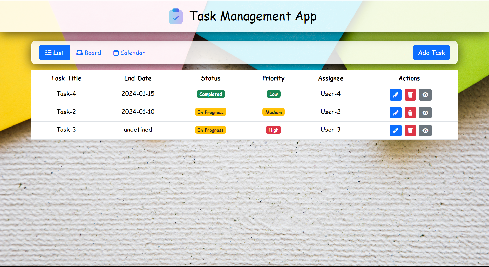
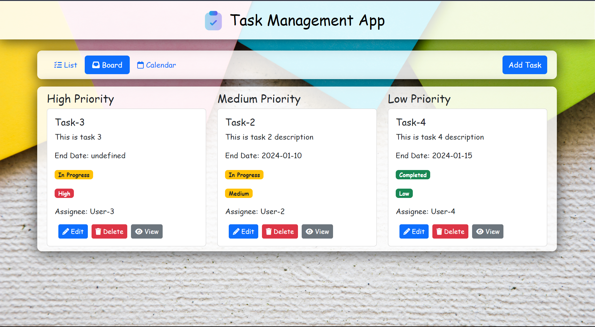
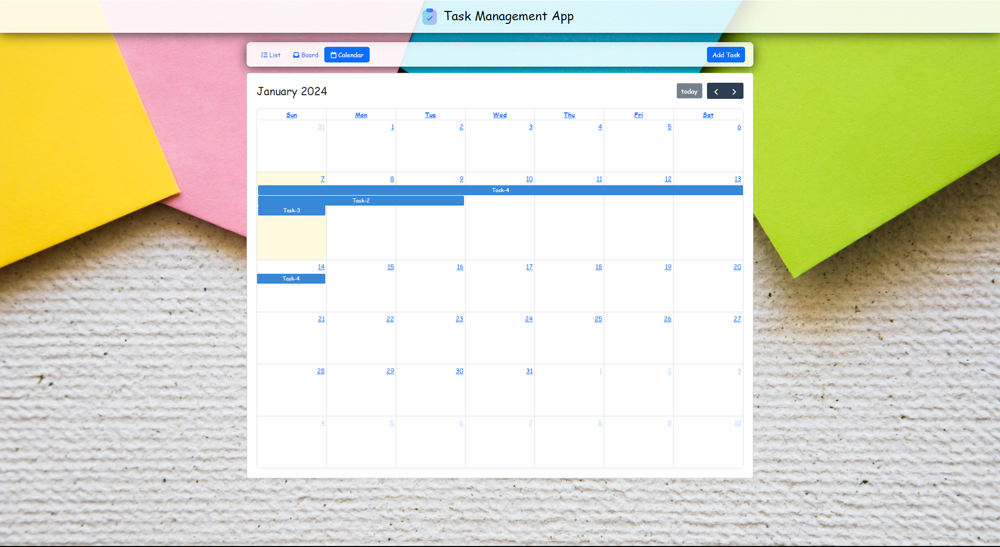

# Task Management App

Welcome to the Task Management App! This web application allows you to manage your tasks efficiently through various views, including a list view, board view, and calendar view.

## Table of Contents

- [Features](#features)
- [Screenshots](#screenshots)
- [Getting Started](#getting-started)
- [Usage](#usage)
- [Dependencies](#dependencies)
- [Contributing](#contributing)
- [License](#license)

## Features

- List view for a detailed overview of tasks.
- Board view for a categorized display based on task priority.
- Calendar view for a visual representation of tasks over time.
- Add, edit, and view tasks with ease.

## Screenshots


_List View_


_Board View_


_Calendar View_

## Getting Started

1. Clone the repository:

   ```bash
   git clone https://github.com/your-username/task-management-app.git
   cd task-management-app
   ```

2. Open `index.html` in your preferred web browser.

## Usage

1. Navigate through the tabs (List, Board, Calendar) to view tasks in different formats.
2. Click on "Add Task" to open the modal and add a new task.
3. Edit and view tasks using the respective modals.

## Dependencies

- [Full Calendar](https://fullcalendar.io/) - Version 6.1.10
- [Bootstrap](https://getbootstrap.com/) - Version 5.3.2
- [Font Awesome](https://fontawesome.com/) - Version 6.0.0

## Contributing

If you'd like to contribute to the project, please follow these steps:

1. Fork the repository.
2. Create a new branch for your feature or bug fix.
3. Make your changes and submit a pull request.

## License

This project is licensed under the [MIT License](LICENSE).

---
